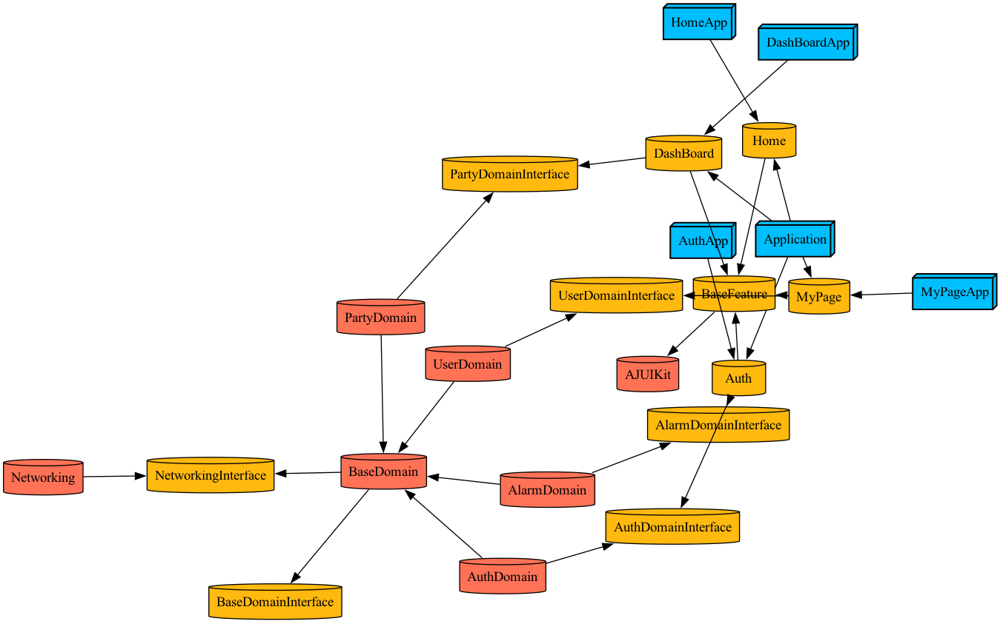

# 알죠앱 - iOS

## 사용법
1. Install Tuist
   
    ```bash
    curl -Ls https://install.tuist.io | bash
    ```

2. Tuist Signing 데이터 추가

3. Update Dependencies
    ```bash
    tuist fetch
    ```

    ```bash
    tuist fetch --update
    ```

4. Run Tuist Generate
    ```bash
    tuist generate
    ```

5. Run Tuist Scaffold
    ```bash
    tuist scaffold Modules --l "LayerName" --n "Name" --t "targetname"
    tuist scaffold Interface --l "LayerName" --n "Name"
    tuist scaffold Sources --l "LayerName" --n "Name"
    ```

## 모듈화 그래프
